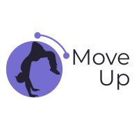

<div align="center">
  <a href="https://github.com/bernardoco/move-up">
    
  </a>
</div>

# Move Up

This is a project for the Advanced Programming discipline at the Federal University of Rio de Janeiro (UFRJ).
Move Up is a platform to find and schedule group sports activities. The intended final product could have a matchmaking system for pairing players in a soccer match, for example. This project was developed using the MERN stack (MongoDB, Express, React, Node).
For now, this application is capable of:
* Create an Event
* Delete an existing Event
* Sign in for an Event
* Show participants signed in for an existing Event

## Getting Started
Clone this repository
```
git clone https://github.com/bernardoco/move-up
```
Install dependencies and run server
```
cd ./backend
npm install
node index.js
```
Install dependencies and run client
```
cd ./frontned
npm install
npm start
```
Open in browser
```
localhost:3000
```

## Start with Docker
Clone this repository
```
git clone https://github.com/bernardoco/move-up
```
Build images and run containers with docker-compose
```
docker-compose build
docker-compose up -d
```
Open in browser
```
localhost
```
